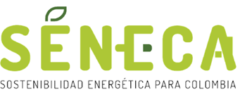
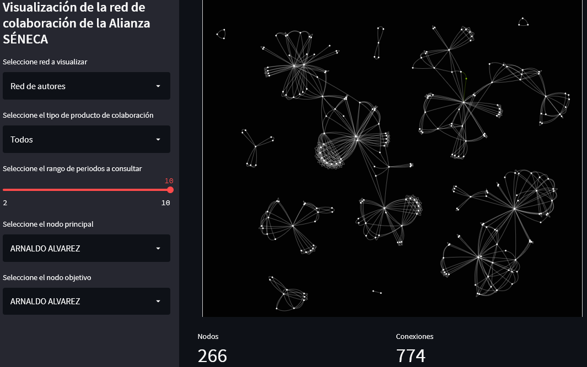

<!-- PROJECT SHIELDS -->

<!--
*** I'm using markdown "reference style" links for readability.
*** Reference links are enclosed in brackets [ ] instead of parentheses ( ).
*** See the bottom of this document for the declaration of the reference variables
*** for contributors-url, forks-url, etc. This is an optional, concise syntax you may use.
*** https://www.markdownguide.org/basic-syntax/#reference-style-links
-->

<!-- PROJECT LOGO -->

 

  

<h3 align="center">SENECA-NET</h3>

    Herramienta de visualización y análisis de la red de colaboración científica de la Alianza.  
     
    <a href="documentacion.md"><strong>Documentación »</strong></a>
     
     
    <a href="https://avel1956-seneca-net-home-6v56a3.streamlitapp.com/">Usar aplicación</a>
    ·
    <a href="#contribuir">Reportar errores</a>

<!-- TABLE OF CONTENTS -->

  
Tabla de contenidos

  <ol>
    <li>
      <a href="#acerca-del-proyecto">Acerca del proyecto</a>
      <ul>
        <li><a href="#construido-con">Construido con</a></li>
      </ul>
    </li>
</li>
<li><a href="#inicio-rápido">Inicio rápido</a></li>
<li><a href="#uso">Uso</a></li>
<li><a href="#por-hacer">Por hacer</a></li>
<li><a href="#contribuir">Contribuir</a></li>
<li><a href="#licencia">Licencia</a></li>
<li><a href="#contacto">Contacto</a></li>
<li><a href="#agradecimientos">Agradecimientos</a></li>

</ol>

<!-- ABOUT THE PROJECT -->

****

## Acerca del proyecto

> Esta es una versión temprana de la aplicación y está en desarrollo activo, por lo que es de esperarse que existan errores. [Su retroalimentación es esencial](#contribuir).   

La creación de una red científica con el alcance y la envergadura de SENECA es no solo un reto monumental desde el punto de vista científico, sino también una rara oportunidad de estudiar la evolución de una red de estas características durante la ejecución del proyecto marco.

En este caso, se presenta una herramienta para la construcción y análisis de la red de coautorías de la Alianza con el fin de ofrecer alternativas de representación del desempeño relacional de personas, grupos e instituciones  que puedan ser tenidas en cuenta en la toma de decisiones y la formulación de estrategias de cooperaciones futuras.  

(<a href="#top">Inicio</a>)

### Construido con:

* [Python 3](https://www.python.org/)

(<a href="#top">Inicio</a>)

<!-- GETTING STARTED -->

## Inicio rápido

Puede comenzar [aquí](https://avel1956-seneca-net-home-6v56a3.streamlitapp.com/) 

### Prerrequisitos

Esta aplicación no requiere mas que un navegador y acceso a internet.

(<a href="#top">Inicio</a>)

<!-- USAGE EXAMPLES -->

## Uso

De acuerdo a su sistema y la calidad de su conexión, la red puede tomar **uno o dos minutos** en cargar dado que por defecto muestra la red mas compleja de todas las disponibles. Una vez hecha esta carga inicial, puede interactuar con las opciones de segmentación y selección del panel lateral.

> Puede seleccionar el tipo de red basado en el nivel de relacionamiento que desee consultar:

- Red de autores

- Red de grupos `Experimental!`

- Red de instituciones

> Puede segmentar la red resultante según el tipo de producto de colaboración:

- Todos

- Artículo A1

- Artículo A2

- Artículo B

- Artículo C

- Capítulo de libro A1

- Capítulo de libro A2

- Ponencia 

> Puede filtrar por periodo y visualizar la evolución de la red durante la ejecución.  

(<a href="#top">Inicio</a>)

<!-- ROADMAP -->

## Por hacer

- [x] Implementación de la primera versión de la aplicación con análisis e interactividad básicos.
- [ ] Perfeccionamiento del *dataset*.
- [ ] Usar técnicas de NPL para construir red semántica.
- [ ] Incorporar funcionalidades de predicción de nodos y bordes.  
- [ ] Generalización de la aplicación para su uso con otros *datasets*. 
- [ ] Ampliar en número de parámetros a calcular. 
- [ ] Mejora en la interactividad.  

(<a href="#top">Inicio</a>)

<!-- CONTRIBUTING -->

## Contribuir

La mejor forma de contribuir al proyecto en este punto del desarrollo consiste en reportar cualquier error en los nombres de personas, grupos o instituciones que forman parte de la red. Si usted pertenece a la Alianza y detecta algún error, por favor no dude en reportarlo a [jaime.velezz@udea.edu.co]([jaime.velezz@udea.edu.co](mailto:jaime.velezz@udea.edu.co)).

(<a href="#top">Inicio</a>)

<!-- CONTACT -->

## Contacto

Jaime Andrés Vélez Zea   - [@javelezea](https://twitter.com/javelezea)

Sitio de la Alianza: [SENECA](https://www.udea.edu.co/wps/portal/udea/web/inicio/investigacion/seneca)

(<a href="#top">Inicio</a>)

<!-- ACKNOWLEDGMENTS -->

## Agradecimientos

* 
* 
* 

(<a href="#top">Inicio</a>)

<!-- MARKDOWN LINKS & IMAGES -->