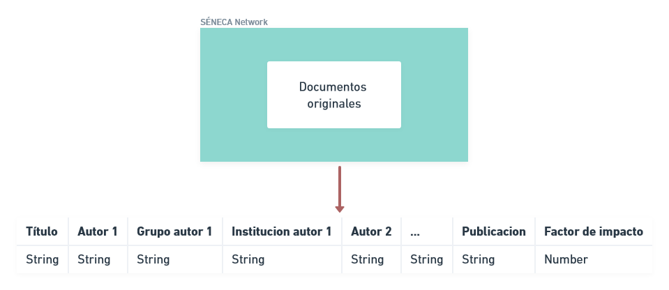
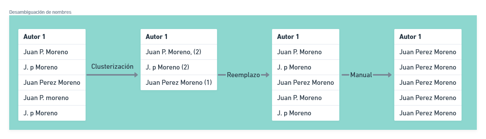
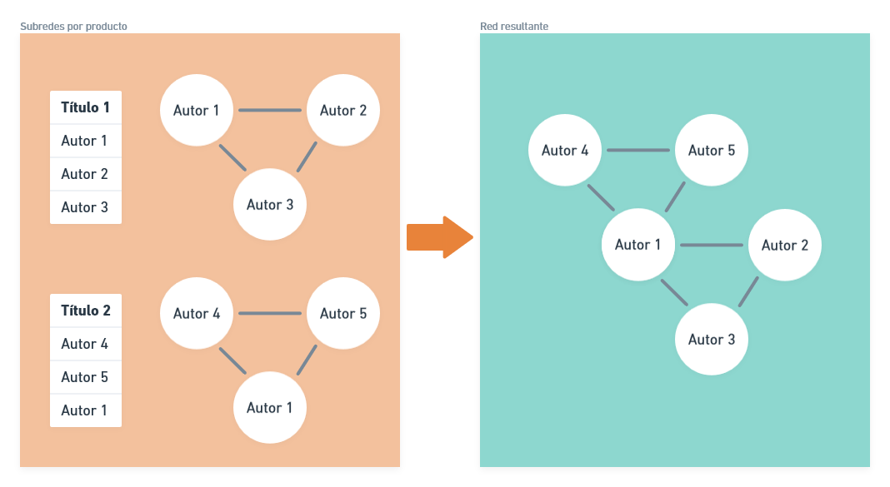

# SENECA-NET

> Esta página está en **construcción**

## Obtención de los datos

Todos los productos de la Alianza son reportados por los investigadores principales de cada proyecto a la Subdirección de Fortalecimiento Institucional a través de la herramienta SSOFI. En el caso particular de la producción de nuevo conocimiento y ponencias, se almacena además de los datos básicos de cada producto, una copia en PDF del artículo o certificado usado como prueba de existencia.

## Preprocesamiento

Dada la heterogeneidad de las revistas y congresos en los cuales se presentan los resultados de la investigación de la Alianza, se decide recurrir a la obtención manual de los datos de autores, afiliaciones (grupo de investigación, institución), nombre de la revista (o congreso) y factor de impacto (en caso de tenerlo).

La información resultante es consolidada en un archivo CSV sobre el cual se aplican procedimientos estándar de limpieza y acondicionamiento tales como la eliminación de puntuación, espacios en blanco, etc.
La desambiguación de los nombres se lleva a cabo en dos fases:

- Clusterización: En cada columna del archivo se aplica un algoritmo a través del cual se agrupan las ocurrencias similares de un nombre y se selecciona la mas común, que pasa a ser la instancia del nombre para todas las ocurrencias similares.
- Edición manual: Para los casos en los que la aproximación automática no es suficiente.

## Procesamiento

El procesamiento de los datos en detalle puede seguirse en los comentarios del código fuente en el repositorio, sin embargo, se aclaran algunos de los aspectos importantes:

- Para cada producto se crea una red en la cual varios coautores (*nodos*) están conectados entre si por bordes (*edges*).

- Dado que las relaciones son simétricas (todos los autores se consideran igual de importantes), la red resultante es adireccional.

- La red global es la suma de las redes de cada producto, solo se conserva una conexión por cada par de nodos y el borde resultante tiene las características del ultimo producto en el cual dicho par haya aparecido.

## Visualización

El código de la aplicación esta escrito en Python 3 y la mayor parte del procesamiento se hace usando [Pandas](https://pandas.pydata.org/) y [Networkx](https://networkx.org/), sin embargo la representación de los datos de la red de forma atractiva e interactiva requiere el uso de dos módulos en particular:

- [**Pyvis**:](https://pyvis.readthedocs.io/en/latest/#) este modulo permite la generación de gráficos de red altamente personalizables a partir de una red creada en Networkx, heredando las características de esta. Permite guardar la red resultante como una pagina HTLM que puede visualizarse en cualquier navegador usando los recursos computacionales del usuario y, particularmente, permite insertar el grafico en  cualquier aplicación web.
- [**Streamlit:**](https://streamlit.io/) este modulo ofrece la posibilidad de crear una UI que permite al usuario interactuar con la red y analizarla desde una pagina web albergada online.
